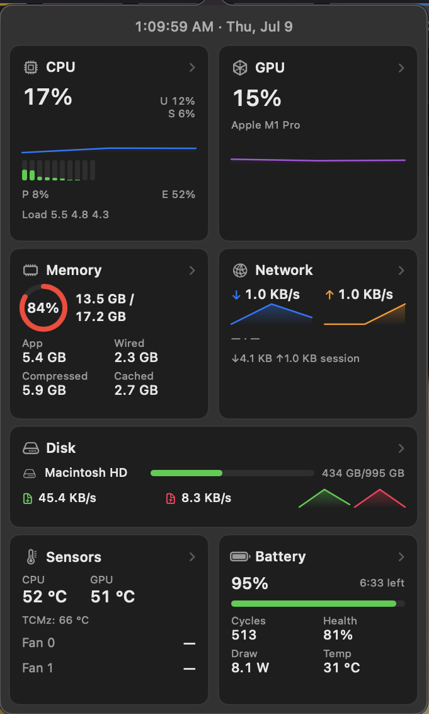

# top

A lightweight, native macOS menu bar system monitor — a simple, fast
alternative to iStat Menus. Live network speed right in the menu bar; click
for CPU, GPU, memory, disk, sensors, and battery, all in one compact view.

<p align="center">
  
</p>


## Features

- **Live network speed** in the menu bar icon (↑/↓, fixed width so it never
  jitters as the numbers change)
- **One-click dashboard**: CPU, GPU, Memory, Network, Disk, Sensors,
  Battery & Power, Date & Time — fits in one view, no scrolling
- **Click any section for detail** — e.g. the compact view shows CPU/GPU
  temperature, but clicking "Sensors" opens every individual sensor reading
  and every fan; clicking "Network" lists every interface, not just the
  active one
- **Right-click the icon to quit** — no button cluttering the dashboard
- Minimal footprint: one Swift process, no helper daemons, polls system
  APIs on a 1-second timer

## Install

### Homebrew (recommended)

```sh
brew tap whitesticker/top
brew install --cask top
```

### Manually

Download the `.zip` from the [latest release](https://github.com/whitesticker/top/releases/latest),
unzip, and drag `top.app` to `/Applications`.

### From source

```sh
git clone https://github.com/whitesticker/top.git
cd top
./build.sh
open build/top.app
```

Requires macOS 13+ and the Swift toolchain from Xcode Command Line Tools
(`xcode-select --install`) — no Xcode project, no Xcode required.
`build.sh` compiles everything with `swiftc` directly and assembles the
`.app` bundle by hand; it also auto-detects a matching SDK if your default
one doesn't line up with your compiler version.

To launch automatically at login: System Settings → General → Login Items,
add `top.app`.

### First launch (Gatekeeper)

This app is ad-hoc signed, not notarized by Apple, so macOS will warn that
it "cannot be opened" the first time. Right-click `top.app` in Finder and
choose **Open** (instead of double-clicking) to bypass this once. The
Homebrew cask does this for you automatically.

## Usage

- **Click** the menu bar icon to open the dashboard.
- **Click a section card** (the ones with a `›` chevron) for its full detail
  in a secondary popover.
- **Right-click** the icon for the quit menu.

## How it works

Each metric category is its own collector polling the relevant system API
directly:

| Category | Source |
|---|---|
| CPU | `host_processor_info` (per-core ticks), `sysctl` (P/E core counts, load avg) |
| GPU | IOKit `IOAccelerator` performance statistics |
| Memory | `host_statistics64` (VM stats), `sysctl` (swap, pressure level) |
| Network | Routing socket (`NET_RT_IFLIST2`) for 64-bit interface counters |
| Disk | `FileManager` volume info + IOKit `IOBlockStorageDriver` statistics |
| Sensors | Apple SMC (System Management Controller) direct queries |
| Battery | `IOPowerSources` + `AppleSmartBattery` IORegistry properties |

A central polling loop (`SystemMonitor`) ticks every collector once a
second, publishes an immutable snapshot, and the SwiftUI dashboard renders
reactively from it.

```
Sources/top/
├── Models.swift              shared data structures for every metric
├── Formatters.swift          byte/speed/percent/temp string formatting
├── *Monitor.swift            one collector per category
├── SystemMonitor.swift       central polling loop + history buffers
├── StatusItemController.swift  menu bar icon + popover lifecycle
├── NetworkIconRenderer.swift  draws the live ↑/↓ menu bar icon
├── DashboardView.swift       the SwiftUI dashboard
└── Components.swift          shared dashboard UI pieces (cards, sparklines, gauges)
```

## Contributing

Issues and PRs welcome. It's a small codebase (~3,000 lines) — if you're
adding a metric, follow the existing `*Monitor.swift` pattern: one class,
one `sample()` method, safe defaults on any failure.

## License

MIT — see [LICENSE](LICENSE).
